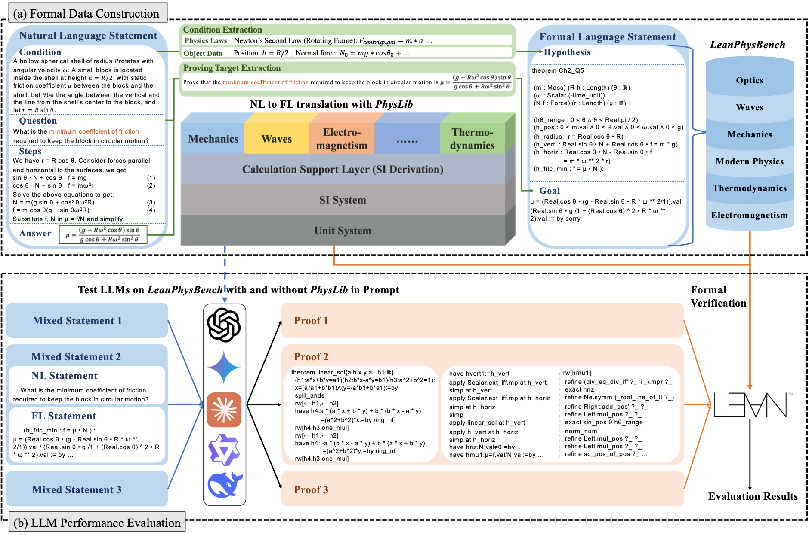
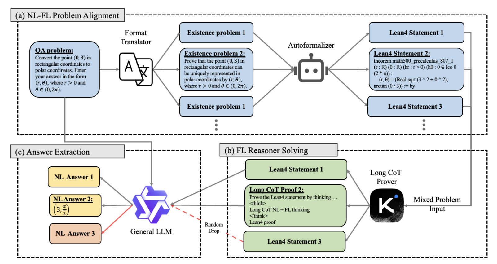
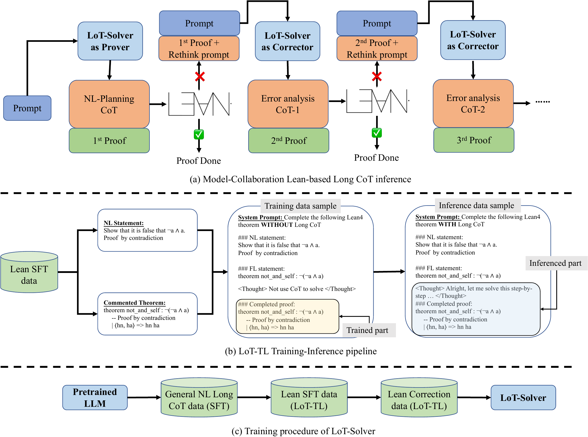

Hi! I am a senior undergraduate student in Computer Science at the Hong Kong University of Science and Technology (HKUST). My research interest includes large language models, natural language processing and trustworthy machine learning. I am currently working on Formal Language for LLM reasoning.  

I am actively seeking **PhD opportunities for Fall 2026** and would be excited to explore potential collaborations. Please feel free to reach out if you have any relevant opportunities or ideas for collaboration. 

Education
======
* Bachelor of Engineering in Computer Science, Hong Kong University of Science and Technology (HKUST),  2022-2026(expected)
  
Research project
======
### \[Preprint\] Lean4Physics: Comprehensive Reasoning Framework for College-level Physics in Lean4 [\[Paper\]](https://arxiv.org/abs/2510.26094)
  **Yuxin Li**\*, Minghao Liu\*, Ruida Wang\*, Wenzhao Ji, Zhitao He, Rui Pan, Junming Huang, Tong Zhang, Yi R. (May) Fung (\* indicates first authors)
  

### \[EMNLP 2025\] Let's Reason Formally: Natural-Formal Hybrid Reasoning Enhances LLM's Math Capability [\[Paper\]](https://arxiv.org/abs/2505.23703)
  Ruida Wang\*, **Yuxin Li**\*, Yi R. (May) Fung, Tong Zhang (\* indicates first authors)
  

### \[ICML 2025\] MA-LoT: Model-Collaboration Lean-based Long Chain-of-Thought Reasoning enhances Formal Theorem Proving [\[Website\]](https://ma-lot.github.io/) [\[Paper\]](https://arxiv.org/pdf/2503.03205) [\[Github\]](https://github.com/RickySkywalker/LeanOfThought-Official)
  Ruida Wang\*, Rui Pan\*, **Yuxin Li**\*, Jipeng Zhang, Yizhen Jia, Shizhe Diao, Renjie Pi, Junjie Hu, Tong Zhang (\* indicates first authors)
  

### Explore Selective Disclosure Bias with Networks of LLM-based Agents
  (Supervised by Prof. [Yongren SHI](https://scholar.google.com/citations?user=4qEFbz8AAAAJ&hl=en), The University of Arizona)
  * Developed a simulation to study how selective disclosure bias affects opinion segregation.
  * Demonstrated that interactions with acquaintances or strangers can facilitate the spread of unpopular norms, whereas interactions with close 
friends or family may hinder information cascades.

Skills
======
* Python, Java, C++, LaTeX, RISC-V

Courses
======
* Mathmetics & physics: Calculus, Multivariable Calculus, Linear Algebra, Applied Statistics, Probability, Discrete Mathematical Tools for Computer Science, General Physics with Calculus.
* Computer Science: Large Language Model, Machine Learning, Large-Scale Machine Learning for Foundation Models, Fundamentals of Artificial Intelligence, Programming with C++, Object-Oriented Programming and Data Structures, Design and Analysis of Algorithms, Cryptography, Computer Architecture, Operating System, Exploring and Visualizing Data. 
* Applied Mathmetics & Computer Science: Fundamentals of Actuarial Mathematics, Introduction to Electro-Robot Design, Electronic and Information Technology, Introduction of Industrial Engineering and Decision Analytics.
